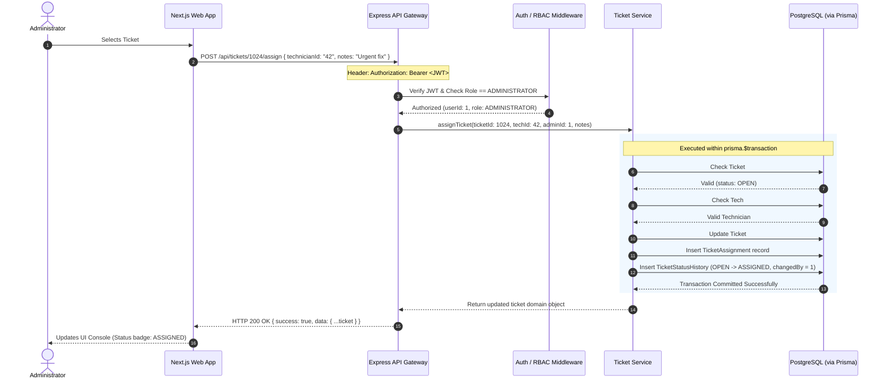

# System Architecture: CBE IT Support Ticket Management System

> **Document Status:** Complete / Architectural Baseline (Phase 1)  
> **Topology:** Monorepo with Decoupled Frontend & Backend Architecture  

---

## 1. High-Level Architectural Model

The system follows a strict **N-Tier Client-Server Architecture** designed for high modularity, testability, and defense against privilege escalation. Direct client access to the database is prohibited.

```
                                [ CLIENT TIER ]
                               +-----------------+
                               |  Web Browser    |
                               | (React / Client)|
                               +--------+--------+
                                        |
                                        v
                               +-----------------+
                               | Next.js App     |
                               | Server / SSR    |
                               +--------+--------+
                                        |
                             REST / JSON via HTTPS
                             (Authorization: Bearer <JWT>)
                                        |
                                        v
                            [ APPLICATION TIER ]
                 +---------------------------------------------+
                 |             Express.js REST API             |
                 |                                             |
                 | +-----------------------------------------+ |
                 | | Global Middleware: Helmet, CORS, Limiter| |
                 | +--------------------+--------------------+ |
                 |                      |                      |
                 |                      v                      |
                 | +-----------------------------------------+ |
                 | | Auth & RBAC Guard: JWT verify, Role chk | |
                 | +--------------------+--------------------+ |
                 |                      |                      |
                 |                      v                      |
                 | +-----------------------------------------+ |
                 | | Zod Request Validation & Sanitization   | |
                 | +--------------------+--------------------+ |
                 |                      |                      |
                 |                      v                      |
                 | +-----------------------------------------+ |
                 | | Controller Layer (HTTP mapping)         | |
                 | +--------------------+--------------------+ |
                 |                      |                      |
                 |                      v                      |
                 | +-----------------------------------------+ |
                 | | Service Layer (Business Logic & FSM)    | |
                 | +--------------------+--------------------+ |
                 |                      |                      |
                 |                      v                      |
                 | +-----------------------------------------+ |
                 | | Prisma ORM (Type-safe query builder)    | |
                 | +--------------------+--------------------+ |
                 +----------------------|----------------------+
                                        |
                           PostgreSQL Connection Pool
                                        |
                                        v
                              [ DATA TIER ]
                 +---------------------------------------------+
                 |        PostgreSQL Database (Supabase)       |
                 |                                             |
                 |  - Relational Foreign Keys & Indexes        |
                 |  - ACID Transactional Engine                |
                 |  - Referential Integrity (ON DELETE RESTRICT)|
                 +---------------------------------------------+
```

---

## 2. Layer Responsibilities & Boundaries

### 2.1 Presentation Tier: Next.js Frontend
* **Technology:** Next.js (App Router), React, Tailwind CSS, shadcn/ui component library, TanStack React Query / Axios.
* **Responsibilities:**
  * Render accessible, responsive web interfaces tailored to the authenticated user's role (`/employee`, `/technician`, `/admin`).
  * Capture user input with client-side validation feedback (Zod + React Hook Form).
  * Securely handle the JWT token (stored in HttpOnly secure cookies or application auth state).
  * **Strict Boundary:** The frontend contains **zero** database connection strings, **zero** SQL queries, and **zero** direct Prisma dependencies. It communicates with the backend solely via RESTful JSON APIs.

### 2.2 Security & Routing Tier: Express.js REST Gateway
* **Technology:** Express.js, TypeScript, Helmet, CORS, express-rate-limit.
* **Responsibilities:**
  * Intercept incoming HTTP requests, enforce CORS policies, sanitize headers, and throttle anomalous request volumes.
  * Extract and cryptographically verify the JWT bearer token.
  * Inspect the authenticated user's role against route-level permission matrices (RBAC).
  * Validate request bodies, query params, and URL route parameters against strict Zod schemas before passing control downstream.

### 2.3 Business Domain Tier: Service & Controller Layer
* **Technology:** Pure TypeScript domain services.
* **Responsibilities:**
  * **Controllers:** Extract inputs from Express `req`, invoke domain service methods, and serialize domain outputs into standard JSON envelopes (`{ success: true, data: ... }` or `{ success: false, error: ... }`).
  * **Services:** Enforce all business rules, lifecycle state machines, and relational checks (e.g., verifying a technician is active before assignment, verifying that `resolutionNotes` are supplied when marking a ticket resolved).
  * **Transactional Orchestration:** Wrap multi-step operations (e.g., updating ticket status + inserting a status history audit entry + notifying assignee) within `prisma.$transaction`.

### 2.4 Persistence Tier: Prisma ORM & PostgreSQL (Supabase)
* **Technology:** Prisma ORM, PostgreSQL (hosted on Supabase infrastructure).
* **Responsibilities:**
  * Execute strongly-typed, parameterized SQL statements generated by Prisma Client.
  * Maintain ACID transaction guarantees for critical operations.
  * Provide connection pooling, relational constraints, foreign keys, and indexes for performant analytical queries.

---

## 3. Communication Sequence: Ticket Assignment Flow



---

## 4. Architectural Boundaries and Defensibility

1. **No Backend Logic in the Client:** All business authorization checks are duplicated and rigorously enforced on the server. If a malicious user attempts to craft a raw HTTP request to update a ticket they do not own, the Express service will reject it with HTTP 403.
2. **Defensive Auditability:** State changes cannot occur without audit records because database updates are co-located in atomic transactions.
3. **Database Portability:** Although Supabase provides PostgreSQL hosting, Prisma interacts using standard PostgreSQL connection protocols (`postgres://...`). This ensures zero vendor lock-in to Supabase-specific proprietary APIs.
