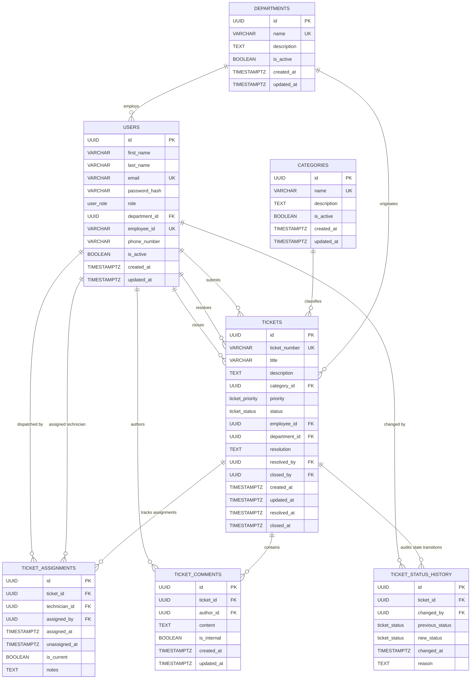

# Database Design: CBE IT Support Ticket Management System

> **Document Status:** Complete / Definitive Database Architecture Baseline  
> **Database Name:** `cbe-it-support-system-db`  
> **Target RDBMS:** PostgreSQL (v14+)  
> **Environment:** Local PostgreSQL Instance  
> **Database Administration Tool:** pgAdmin 4  
> **ORM Target:** Prisma ORM  
> **Project Context:** Information Systems (IS) Department, Commercial Bank of Ethiopia (CBE) — Academic Internship Defence Project  

---

## 1. Database Overview

The **CBE IT Support Ticket Management System** requires a resilient, normalized, and highly auditable relational database to underpin its internal IT service-desk operations. In an enterprise banking context, ad-hoc, untracked IT support requests lead to unmonitored downtime, lack of technician accountability, and loss of institutional incident knowledge. This database provides the structural foundation for logging, dispatching, troubleshooting, and resolving hardware, software, and network incidents across bank branches and head-office departments.

### Key Environment Parameters
* **Database Name:** `cbe-it-support-system-db`
* **DBMS Engine:** PostgreSQL (v14+)
* **Development Management:** pgAdmin 4 Query Tool & Object Explorer
* **Future Application Tier:** Express.js REST API using Prisma ORM (Prisma will map directly to this schema)
* **Hosting Model:** Local PostgreSQL instance during Phase 1/2 development (Supabase is explicitly **not** used for this stage)

### Design Philosophy
* **Strict Third Normal Form (3NF):** Eliminates data redundancy and update anomalies while maintaining relational integrity.
* **Non-Destructive Deletion (Soft Deactivation):** Prevents the destruction of historical banking IT service records.
* **Audit-First Architecture:** Append-only history and assignment tracking tables preserve full lifecycle accountability.
* **Defensive Constraints:** Relational foreign keys enforce `ON DELETE RESTRICT` on core business entities to ensure zero orphaned service tickets.

---

## 2. Database Architecture

The database operates as the single source of truth within a decoupled N-Tier enterprise architecture:

```text
[ Client Presentation Tier ]
       Next.js Web Application (React, Tailwind CSS, shadcn/ui)
                     │
                     │  HTTPS / RESTful JSON / Bearer JWT
                     v
[ Application Logic Tier ]
       Express.js API Server (Node.js, TypeScript)
       ├── Global Security: Helmet, CORS, Rate Limiter
       ├── Authentication & Role-Based Access Control (RBAC)
       ├── Input Validation: Zod Schemas
       └── Domain Service Layer (State Machine, Business Invariants)
                     │
                     │  Type-Safe Parameterized Queries
                     v
[ Object-Relational Mapping (ORM) ]
       Prisma ORM Client (Schema-compatible mapping)
                     │
                     │  Native PostgreSQL Protocol
                     v
[ Persistence Data Tier ]
       Local PostgreSQL Database: cbe-it-support-system-db
       ├── Schemas, Enums, Tables, Sequences
       ├── Declarative Constraints (PK, FK, UK, CHECK)
       ├── B-Tree Performance & Composite Indexes
       └── Managed via pgAdmin 4
```

---

## 3. Entity List

The database architecture is centered on seven (7) core normalized entities. Every entity has a distinct domain responsibility:

| Entity / Table Name | Domain Responsibility |
| :--- | :--- |
| **`departments`** | Stores organizational branches, directorates, and internal IT units within CBE. |
| **`users`** | Single consolidated user repository storing credentials, roles (`EMPLOYEE`, `TECHNICIAN`, `ADMINISTRATOR`), and profile data. |
| **`categories`** | Database-managed IT incident categories (e.g., Hardware, Software, Network) allowing administrative catalog updates without code modification. |
| **`tickets`** | Central incident entity tracking problem descriptions, priority, lifecycle status, submitter, department, and resolution notes. |
| **`ticket_assignments`** | Dedicated assignment audit log capturing current and historical technician assignments, dispatches, and reassignments. |
| **`ticket_comments`** | Threaded communication entries, distinguishing public dialogue from internal technical troubleshooting notes (`is_internal`). |
| **`ticket_status_history`** | Strictly append-only audit trail recording every lifecycle state change, timestamp, and responsible user. |

---

## 4. Detailed Table Specifications

### 4.1 Table: `departments`
* **Purpose:** Represents organizational units across the bank. Users belong to departments, and tickets snapshot the requesting department.

| Column | Type | Nullable | Default | Key | Description |
| :--- | :--- | :---: | :--- | :---: | :--- |
| `id` | `UUID` | No | `gen_random_uuid()` | PK | Surrogate unique identifier |
| `name` | `VARCHAR(100)` | No | *None* | UNIQUE | Full official name of the department/branch |
| `description` | `TEXT` | Yes | `NULL` | — | Scope, mandate, or location details |
| `is_active` | `BOOLEAN` | No | `TRUE` | — | Soft-deactivation flag (deactivated depts cannot log new tickets) |
| `created_at` | `TIMESTAMPTZ` | No | `CURRENT_TIMESTAMP` | — | Record creation timestamp |
| `updated_at` | `TIMESTAMPTZ` | No | `CURRENT_TIMESTAMP` | — | Timestamp of latest record update |

---

### 4.2 Table: `users`
* **Purpose:** Consolidated authentication and identity record for all personnel. Avoids polymorphic user tables while supporting distinct roles.

| Column | Type | Nullable | Default | Key | Description |
| :--- | :--- | :---: | :--- | :---: | :--- |
| `id` | `UUID` | No | `gen_random_uuid()` | PK | Surrogate unique identifier |
| `first_name` | `VARCHAR(50)` | No | *None* | — | User's given name |
| `last_name` | `VARCHAR(50)` | No | *None* | — | User's family / father's name |
| `email` | `VARCHAR(255)` | No | *None* | UNIQUE | Official institutional email address (used for login) |
| `password_hash` | `VARCHAR(255)` | No | *None* | — | One-way cryptographic hash (`bcrypt` / `argon2id`) |
| `role` | `user_role` | No | `'EMPLOYEE'` | — | Security classification: `EMPLOYEE`, `TECHNICIAN`, `ADMINISTRATOR` |
| `department_id` | `UUID` | No | *None* | FK | Foreign key referencing `departments(id)` |
| `employee_id` | `VARCHAR(50)` | Yes | `NULL` | UNIQUE | Institutional CBE Staff / Badge identification number |
| `phone_number` | `VARCHAR(30)` | Yes | `NULL` | — | Official desk extension or mobile contact number |
| `is_active` | `BOOLEAN` | No | `TRUE` | — | Account status flag (inactive accounts cannot log in) |
| `created_at` | `TIMESTAMPTZ` | No | `CURRENT_TIMESTAMP` | — | Record creation timestamp |
| `updated_at` | `TIMESTAMPTZ` | No | `CURRENT_TIMESTAMP` | — | Timestamp of latest record update |

---

### 4.3 Table: `categories`
* **Purpose:** IT support problem categories (e.g., Hardware, Network, Core Banking). Maintained via database to empower administrators to add or adjust categories dynamically.

| Column | Type | Nullable | Default | Key | Description |
| :--- | :--- | :---: | :--- | :---: | :--- |
| `id` | `UUID` | No | `gen_random_uuid()` | PK | Surrogate unique identifier |
| `name` | `VARCHAR(50)` | No | *None* | UNIQUE | Distinct category name |
| `description` | `TEXT` | Yes | `NULL` | — | Description of issues covered by this category |
| `is_active` | `BOOLEAN` | No | `TRUE` | — | Soft-deactivation flag (inactive categories cannot be selected) |
| `created_at` | `TIMESTAMPTZ` | No | `CURRENT_TIMESTAMP` | — | Record creation timestamp |
| `updated_at` | `TIMESTAMPTZ` | No | `CURRENT_TIMESTAMP` | — | Timestamp of latest record update |

---

### 4.4 Table: `tickets`
* **Purpose:** The central operational entity tracking the complete lifecycle of an IT support incident.

| Column | Type | Nullable | Default | Key | Description |
| :--- | :--- | :---: | :--- | :---: | :--- |
| `id` | `UUID` | No | `gen_random_uuid()` | PK | Surrogate unique identifier |
| `ticket_number` | `VARCHAR(20)` | No | *Generated* | UNIQUE | Formatted human-readable ticket ID (`TKT-000001`) |
| `title` | `VARCHAR(150)` | No | *None* | — | Concise title of the technical issue |
| `description` | `TEXT` | No | *None* | — | In-depth description of the failure / symptoms |
| `category_id` | `UUID` | No | *None* | FK | Foreign key referencing `categories(id)` |
| `priority` | `ticket_priority` | No | `'MEDIUM'` | — | Priority level: `LOW`, `MEDIUM`, `HIGH`, `CRITICAL` |
| `status` | `ticket_status` | No | `'OPEN'` | — | Current state: `OPEN`, `ASSIGNED`, `IN_PROGRESS`, `RESOLVED`, `CLOSED`, `CANCELLED` |
| `employee_id` | `UUID` | No | *None* | FK | Submitting user referencing `users(id)` |
| `department_id` | `UUID` | No | *None* | FK | Department snapshotted at submission time |
| `resolution` | `TEXT` | Yes | `NULL` | — | Mandatory technical explanation when resolved |
| `resolved_by` | `UUID` | Yes | `NULL` | FK | Technician/Admin who resolved referencing `users(id)` |
| `closed_by` | `UUID` | Yes | `NULL` | FK | Admin/User who formally closed referencing `users(id)` |
| `created_at` | `TIMESTAMPTZ` | No | `CURRENT_TIMESTAMP` | — | Submission timestamp |
| `updated_at` | `TIMESTAMPTZ` | No | `CURRENT_TIMESTAMP` | — | Timestamp of latest record update |
| `resolved_at` | `TIMESTAMPTZ` | Yes | `NULL` | — | Timestamp when status transitioned to `RESOLVED` |
| `closed_at` | `TIMESTAMPTZ` | Yes | `NULL` | — | Timestamp when status transitioned to `CLOSED` |

---

### 4.5 Table: `ticket_assignments`
* **Purpose:** Captures technician assignment and reassignment events. Maintains a complete historical log of who worked on the ticket, who dispatched them, and when.

| Column | Type | Nullable | Default | Key | Description |
| :--- | :--- | :---: | :--- | :---: | :--- |
| `id` | `UUID` | No | `gen_random_uuid()` | PK | Surrogate unique identifier |
| `ticket_id` | `UUID` | No | *None* | FK | Referencing `tickets(id)` (`ON DELETE CASCADE`) |
| `technician_id` | `UUID` | No | *None* | FK | Assigned technician referencing `users(id)` |
| `assigned_by` | `UUID` | No | *None* | FK | Dispatching administrator referencing `users(id)` |
| `assigned_at` | `TIMESTAMPTZ` | No | `CURRENT_TIMESTAMP` | — | Timestamp of dispatch |
| `unassigned_at` | `TIMESTAMPTZ` | Yes | `NULL` | — | Timestamp when reassigned (null if still active) |
| `is_current` | `BOOLEAN` | No | `TRUE` | — | Flag indicating whether this is the active assignment |
| `notes` | `TEXT` | Yes | `NULL` | — | Handover instructions or administrative remarks |

---

### 4.6 Table: `ticket_comments`
* **Purpose:** Threaded communication for updates, clarification inquiries, and private technical troubleshooting notes.

| Column | Type | Nullable | Default | Key | Description |
| :--- | :--- | :---: | :--- | :---: | :--- |
| `id` | `UUID` | No | `gen_random_uuid()` | PK | Surrogate unique identifier |
| `ticket_id` | `UUID` | No | *None* | FK | Referencing `tickets(id)` (`ON DELETE CASCADE`) |
| `author_id` | `UUID` | No | *None* | FK | Author referencing `users(id)` |
| `content` | `TEXT` | No | *None* | — | Comment body or diagnostic observation |
| `is_internal` | `BOOLEAN` | No | `FALSE` | — | If `TRUE`, visible only to Technicians/Admins |
| `created_at` | `TIMESTAMPTZ` | No | `CURRENT_TIMESTAMP` | — | Timestamp of comment posting |
| `updated_at` | `TIMESTAMPTZ` | No | `CURRENT_TIMESTAMP` | — | Timestamp of comment edit |

---

### 4.7 Table: `ticket_status_history`
* **Purpose:** Strictly append-only audit trail capturing every lifecycle state change. Ensures complete accountability for IT audit compliance.

| Column | Type | Nullable | Default | Key | Description |
| :--- | :--- | :---: | :--- | :---: | :--- |
| `id` | `UUID` | No | `gen_random_uuid()` | PK | Surrogate unique identifier |
| `ticket_id` | `UUID` | No | *None* | FK | Referencing `tickets(id)` (`ON DELETE CASCADE`) |
| `changed_by` | `UUID` | No | *None* | FK | User who executed state change referencing `users(id)` |
| `previous_status` | `ticket_status` | Yes | `NULL` | — | State before transition (NULL on ticket creation) |
| `new_status` | `ticket_status` | No | *None* | — | State after transition |
| `changed_at` | `TIMESTAMPTZ` | No | `CURRENT_TIMESTAMP` | — | Exact timestamp of status change |
| `reason` | `TEXT` | Yes | `NULL` | — | Reason for cancellation, reopening, or transition |

---

## 5. Relationships and Cardinality

```text
+-----------------------+          1 : N          +-----------------------+
|      departments      | ──────────────────────< |         users         |
+-----------------------+                         +-----------------------+
            │ 1                                               │ 1
            │                                                 │
            │ N (Originates)                                  │ N (Submits)
            v                                                 v
+-------------------------------------------------------------------------+
|                                 tickets                                 |
+-------------------------------------------------------------------------+
       │ 1                      │ 1                       │ 1
       │                        │                         │
       │ N                      │ N                       │ N
       v                        v                         v
+--------------------+   +--------------------+   +-----------------------+
| ticket_assignments |   |  ticket_comments   |   | ticket_status_history |
+--------------------+   +--------------------+   +-----------------------+
```

### Detailed Relational Mappings

1. **`departments` → `users` (`1 : N`):**
   * One department employs many users. Every user belongs to exactly one primary department.
   * Foreign Key: `users.department_id` references `departments.id`.
   * Integrity Rule: `ON DELETE RESTRICT` (A department cannot be deleted while users remain assigned to it).

2. **`departments` → `tickets` (`1 : N`):**
   * One department can be the source of many tickets.
   * Foreign Key: `tickets.department_id` references `departments.id`.
   * Integrity Rule: `ON DELETE RESTRICT` (Historical ticket origin remains intact).

3. **`categories` → `tickets` (`1 : N`):**
   * One category classifies many tickets.
   * Foreign Key: `tickets.category_id` references `categories.id`.
   * Integrity Rule: `ON DELETE RESTRICT` (A category cannot be deleted if historical tickets are tagged with it).

4. **`users` → `tickets` (Multiple Semantic Roles):**
   * **As Submitter (`1 : N`):** `tickets.employee_id` references `users.id` (`ON DELETE RESTRICT`).
   * **As Resolver (`0..1 : N`):** `tickets.resolved_by` references `users.id` (`ON DELETE RESTRICT`).
   * **As Closer (`0..1 : N`):** `tickets.closed_by` references `users.id` (`ON DELETE RESTRICT`).
   * *Prisma Compatibility:* In Prisma, these distinct relationships will use explicit relation names (e.g., `@relation("SubmittedTickets")`, `@relation("ResolvedTickets")`, `@relation("ClosedTickets")`).

5. **`tickets` → `ticket_assignments` (`1 : N`):**
   * A ticket can have multiple assignments across its lifecycle (initial assignment, reassignment, escalations).
   * Foreign Key: `ticket_assignments.ticket_id` references `tickets.id` (`ON DELETE CASCADE`).
   * Additional FKs: `technician_id` references `users.id` (`RESTRICT`), `assigned_by` references `users.id` (`RESTRICT`).

6. **`tickets` → `ticket_comments` (`1 : N`):**
   * A ticket contains zero, one, or many comments.
   * Foreign Key: `ticket_comments.ticket_id` references `tickets.id` (`ON DELETE CASCADE`).
   * Author FK: `ticket_comments.author_id` references `users.id` (`ON DELETE RESTRICT`).

7. **`tickets` → `ticket_status_history` (`1 : N`):**
   * A ticket has an append-only sequence of status transition records.
   * Foreign Key: `ticket_status_history.ticket_id` references `tickets.id` (`ON DELETE CASCADE`).
   * Actor FK: `ticket_status_history.changed_by` references `users.id` (`ON DELETE RESTRICT`).

---

## 6. Entity-Relationship (ER) Diagram



---

## 7. PostgreSQL Enums

The schema defines three custom PostgreSQL enumerated types to ensure strict domain boundaries and type safety:

### 7.1 `user_role`
Constrains user authorization classifications.
```sql
CREATE TYPE user_role AS ENUM (
    'EMPLOYEE',
    'TECHNICIAN',
    'ADMINISTRATOR'
);
```

### 7.2 `ticket_status`
Constrains ticket lifecycle phases.
```sql
CREATE TYPE ticket_status AS ENUM (
    'OPEN',
    'ASSIGNED',
    'IN_PROGRESS',
    'RESOLVED',
    'CLOSED',
    'CANCELLED'
);
```

### 7.3 `ticket_priority`
Defines operational urgency and impact classification.
```sql
CREATE TYPE ticket_priority AS ENUM (
    'LOW',
    'MEDIUM',
    'HIGH',
    'CRITICAL'
);
```

---

## 8. Constraints Design

The database relies on defensive declarative constraints to enforce business invariants at the persistence layer:

### 8.1 Primary Keys & Surrogate Identifiers
Every entity defines a `UUID` primary key using `gen_random_uuid()` as its default generator. This prevents enumeration attacks and eliminates cross-table identifier collisions.

### 8.2 Unique Constraints
* `departments.name`: Prevents duplicate department entries.
* `categories.name`: Guarantees distinct classification labels.
* `users.email`: Enforces single-identity authentication.
* `users.employee_id`: Ensures each institutional staff ID corresponds to at most one user account.
* `tickets.ticket_number`: Guarantees that formatted ticket reference numbers (`TKT-000001`) are globally unique.

### 8.3 NOT NULL Constraints
Applied to all mandatory business fields. For instance, in `tickets`, `title`, `description`, `category_id`, `priority`, `status`, `employee_id`, and `department_id` are strictly `NOT NULL`.

### 8.4 CHECK Constraints
1. **Email Format Validation:**
   ```sql
   CONSTRAINT chk_users_email_format 
   CHECK (email ~* '^[A-Za-z0-9._%+-]+@[A-Za-z0-9.-]+\.[A-Za-z]{2,}$')
   ```
2. **Mandatory Resolution on Resolved/Closed Tickets:**
   ```sql
   CONSTRAINT chk_tickets_resolution_required 
   CHECK (status NOT IN ('RESOLVED', 'CLOSED') OR (resolution IS NOT NULL AND LENGTH(TRIM(resolution)) > 0))
   ```
3. **Timestamp Sequence Consistency on Tickets:**
   ```sql
   CONSTRAINT chk_tickets_timestamps 
   CHECK (
       (resolved_at IS NULL OR resolved_at >= created_at) AND
       (closed_at IS NULL OR closed_at >= created_at)
   )
   ```
4. **Assignment Timeline Integrity:**
   ```sql
   CONSTRAINT chk_assignments_timeline 
   CHECK (unassigned_at IS NULL OR unassigned_at >= assigned_at)
   ```

---

## 9. Indexing Strategy

Indexes are applied intentionally based on the query patterns of the Express API services:

| Index Name | Table | Columns | Type | Targeted Query / Rationale |
| :--- | :--- | :--- | :---: | :--- |
| `idx_users_email` | `users` | `email` | B-Tree | High-frequency authentication queries (`POST /api/auth/login`) |
| `idx_users_role` | `users` | `role` | B-Tree | Filtering active technicians for assignment dropdowns |
| `idx_users_department_id` | `users` | `department_id` | B-Tree | Departmental personnel lookups |
| `idx_tickets_ticket_number` | `tickets` | `ticket_number` | B-Tree | Direct ticket lookup by human-readable reference code |
| `idx_tickets_employee_id` | `tickets` | `employee_id` | B-Tree | Employee portal queries (`GET /api/tickets/my`) |
| `idx_tickets_department_id` | `tickets` | `department_id` | B-Tree | Department-level incident volume aggregation reports |
| `idx_tickets_category_id` | `tickets` | `category_id` | B-Tree | Category distribution reports and queue filtering |
| `idx_tickets_status` | `tickets` | `status` | B-Tree | Filtering open vs. in-progress vs. resolved tickets |
| `idx_tickets_priority` | `tickets` | `priority` | B-Tree | Priority queue sorting (e.g., escalating CRITICAL incidents) |
| `idx_tickets_created_at` | `tickets` | `created_at DESC` | B-Tree | Chronological feed pagination |
| `idx_assignments_ticket_id` | `ticket_assignments` | `ticket_id` | B-Tree | Fetching technician assignment history for a ticket |
| `idx_assignments_technician` | `ticket_assignments` | `technician_id, is_current` | Composite | Technician workspace query (`GET /api/technician/tickets`) |
| `idx_comments_ticket_internal` | `ticket_comments` | `ticket_id, is_internal` | Composite | Segregated comment retrieval (filtering out internal notes) |
| `idx_status_history_ticket` | `ticket_status_history` | `ticket_id, changed_at ASC` | Composite | Rendering chronological audit timeline on ticket details page |

---

## 10. Ticket Lifecycle & State Transitions

The schema supports a formal finite state machine:

```text
    +-----------------------------------------------------------+
    |                                                           |
    v                                                           |
 [ OPEN ] ──(Admin Assigns)──> [ ASSIGNED ] ──(Tech Starts)──> [ IN_PROGRESS ]
    │                               │                                │
    │ (Cancel)                      │ (Cancel)                       │ (Resolve with notes)
    v                               v                                v
[ CANCELLED ]                 [ CANCELLED ]                   [ RESOLVED ]
                                                                     │
                                                                     │ (Admin Confirms)
                                                                     v
                                                                 [ CLOSED ]
```

* **`OPEN`:** Newly submitted incident awaiting administrator review.
* **`ASSIGNED`:** Helpdesk administrator has dispatched a technician via `ticket_assignments`.
* **`IN_PROGRESS`:** Assigned technician has acknowledged the incident and started troubleshooting.
* **`RESOLVED`:** Technician has addressed the incident and entered mandatory `resolution` text.
* **`CLOSED`:** Administrator or employee has confirmed resolution verification. Terminal state.
* **`CANCELLED`:** Ticket cancelled before work commenced with recorded reason. Terminal state.

---

## 11. Auditability & Traceability

In a banking IT environment, all administrative interventions and technician actions must be verifiable:
1. **Status History:** The `ticket_status_history` table records every lifecycle change (`previous_status`, `new_status`, `changed_by`, `changed_at`, and `reason`).
2. **Assignment History:** When a ticket is reassigned from Technician A to Technician B, the active assignment record is updated with `is_current = FALSE` and `unassigned_at = CURRENT_TIMESTAMP`, and a new assignment row is inserted.
3. **Actor Attribution:** Every status update, comment, assignment, and resolution records the responsible `user_id`.

---

## 12. Security Considerations

1. **Password Protection:** Plaintext passwords are never persisted. Only salted cryptographic hashes are stored in `password_hash` (`VARCHAR(255)`).
2. **Information Privacy (Internal Notes):** `ticket_comments.is_internal` allows technicians to record internal IP addresses, firmware versions, or switch ports. The application tier filters out `is_internal = TRUE` records when fulfilling employee requests.
3. **Defense Against Data Destruction:** `ON DELETE RESTRICT` prevents malicious or accidental cascades that would delete tickets upon user removal.
4. **Scope Isolation:** The database stores only operational IT ticket data. No customer account numbers, core banking transaction records, or customer PII are stored.

---

## 13. Key Design Decisions (Decisions A through J)

### Decision A: UUID vs. Integer Primary Keys
* **Options:** Sequential `BIGINT` vs. Random `UUID v4`.
* **Recommendation:** **UUID v4** (`gen_random_uuid()`) for primary and foreign keys, paired with a separate sequential `ticket_number` for human communication.
* **Rationale:** UUIDs prevent URL parameter enumeration attacks (`/api/tickets/1`, `/api/tickets/2`), enable decentralized ID generation, and align with Prisma conventions. For human ergonomics, `ticket_number` provides a sequential reference (`TKT-000001`).

### Decision B: Enum vs. Table for Ticket Categories
* **Options:** PostgreSQL `ENUM` vs. Dedicated `categories` table.
* **Recommendation:** **Dedicated `categories` table**.
* **Rationale:** In an enterprise bank, IT management regularly needs to add or retire categories (e.g., "ATM Peripheral", "Biometric Terminal") without requiring database migrations or application redeployments. Soft deactivation (`is_active = FALSE`) preserves historical ticket categorization.

### Decision C: Enum vs. Table for User Roles
* **Options:** Dedicated `roles` table with M:N mapping vs. PostgreSQL `user_role` `ENUM`.
* **Recommendation:** **PostgreSQL `user_role` ENUM** (`'EMPLOYEE'`, `'TECHNICIAN'`, `'ADMINISTRATOR'`).
* **Rationale:** The system has three fixed authorization boundaries tied to specific application routes and UI layouts. A static enum is performant, type-safe, maps directly to Prisma enums, and eliminates unnecessary join tables.

### Decision D: Dedicated Assignment Entity vs. Single Foreign Key
* **Options:** Storing `assigned_technician_id` directly on `tickets` vs. Dedicated `ticket_assignments` table.
* **Recommendation:** **Dedicated `ticket_assignments` table**.
* **Rationale:** IT support tickets in large organizations frequently undergo reassignment (e.g., shift changes, specialized escalation). A single column overwrites past assignments, destroying technician workload history and resolution time tracking. A dedicated table preserves full historical accountability.

### Decision E: Department Relationship on Tickets
* **Options:** Dynamic lookup via `tickets.employee_id -> users.department_id` vs. Direct `tickets.department_id` foreign key.
* **Recommendation:** **Direct `department_id` on the `tickets` table**.
* **Rationale:** Snapshots the requesting department at the moment the ticket was created. If an employee later transfers from "Retail Banking" to "Finance", historical ticket reporting by department remains historically accurate.

### Decision F: Ticket Number Generation Mechanism
* **Options:** Application-level random string generation vs. PostgreSQL `SEQUENCE` with formatted `DEFAULT`.
* **Recommendation:** **PostgreSQL `SEQUENCE` (`ticket_number_seq`) with formatted `DEFAULT`**.
* **Rationale:**
  ```sql
  DEFAULT ('TKT-' || LPAD(nextval('ticket_number_seq')::text, 6, '0'))
  ```
  Guarantees atomic, strictly increasing, collision-free numbers without application-level locks or race conditions under concurrent submissions.

### Decision G: User Deactivation Strategy
* **Options:** Physical row deletion (`DELETE FROM users`) vs. Soft deactivation (`is_active = FALSE`).
* **Recommendation:** **Soft deactivation via `is_active BOOLEAN`**.
* **Rationale:** Deleting a user would violate referential integrity or orphan historical tickets, assignments, comments, and audit logs. Inactive users are retained for auditing while barred from logging in.

### Decision H: Historical Data Preservation
* **Options:** `ON DELETE CASCADE` across all foreign keys vs. `ON DELETE RESTRICT` on business entities.
* **Recommendation:** **`ON DELETE RESTRICT` on core parents (`users`, `departments`, `categories`)**.
* **Rationale:** Prevents accidental deletion of foundational records. Child transaction tables (`ticket_assignments`, `ticket_comments`, `ticket_status_history`) use `ON DELETE CASCADE` only with respect to `ticket_id`, ensuring no orphaned child records if a test ticket is ever deleted.

### Decision I: Internal Notes Representation
* **Options:** Separate `ticket_internal_notes` table vs. Unified `ticket_comments` table with `is_internal` flag.
* **Recommendation:** **Unified `ticket_comments` table with `is_internal BOOLEAN DEFAULT FALSE`**.
* **Rationale:** Preserves a single chronological conversational stream while allowing the API service layer to filter out internal diagnostics for employees.

### Decision J: Database Triggers vs. Application Coordination
* **Options:** Heavy trigger logic for state transitions and history logging vs. Minimal triggers for timestamps.
* **Recommendation:** **Minimal triggers for `updated_at` timestamps only**.
* **Rationale:** Business logic and state machine transitions should remain explicit in the service layer orchestrated via `prisma.$transaction`. Database triggers for status history create hidden side-effects that complicate debugging and testing.

---

## 14. Complete PostgreSQL SQL Script

Below is the complete, self-contained, executable PostgreSQL DDL script. It is designed to be executed directly in the **pgAdmin 4 Query Tool** connected to `cbe-it-support-system-db`.

```sql
-- ============================================================================
-- CBE IT SUPPORT TICKET MANAGEMENT SYSTEM
-- PostgreSQL Database Schema Specification
-- Target Database: cbe-it-support-system-db
-- Compatibility: PostgreSQL 14+ / Prisma ORM Compatible
-- ============================================================================

-- ----------------------------------------------------------------------------
-- 1. EXTENSIONS
-- ----------------------------------------------------------------------------
-- pgcrypto provides gen_random_uuid() if running on PostgreSQL < 13
CREATE EXTENSION IF NOT EXISTS "pgcrypto";

-- ----------------------------------------------------------------------------
-- 2. SEQUENCES
-- ----------------------------------------------------------------------------
-- Sequence for human-readable ticket numbers (TKT-000001, TKT-000002, ...)
CREATE SEQUENCE IF NOT EXISTS ticket_number_seq
    START WITH 1
    INCREMENT BY 1
    NO MINVALUE
    NO MAXVALUE
    CACHE 1;

-- ----------------------------------------------------------------------------
-- 3. ENUM TYPES
-- ----------------------------------------------------------------------------
DO $$ BEGIN
    IF NOT EXISTS (SELECT 1 FROM pg_type WHERE typname = 'user_role') THEN
        CREATE TYPE user_role AS ENUM (
            'EMPLOYEE',
            'TECHNICIAN',
            'ADMINISTRATOR'
        );
    END IF;
END $$;

DO $$ BEGIN
    IF NOT EXISTS (SELECT 1 FROM pg_type WHERE typname = 'ticket_status') THEN
        CREATE TYPE ticket_status AS ENUM (
            'OPEN',
            'ASSIGNED',
            'IN_PROGRESS',
            'RESOLVED',
            'CLOSED',
            'CANCELLED'
        );
    END IF;
END $$;

DO $$ BEGIN
    IF NOT EXISTS (SELECT 1 FROM pg_type WHERE typname = 'ticket_priority') THEN
        CREATE TYPE ticket_priority AS ENUM (
            'LOW',
            'MEDIUM',
            'HIGH',
            'CRITICAL'
        );
    END IF;
END $$;

-- ----------------------------------------------------------------------------
-- 4. TRIGGER FUNCTION: update_timestamp_column
-- ----------------------------------------------------------------------------
CREATE OR REPLACE FUNCTION update_timestamp_column()
RETURNS TRIGGER AS $$
BEGIN
    NEW.updated_at = CURRENT_TIMESTAMP;
    RETURN NEW;
END;
$$ LANGUAGE plpgsql;

-- ----------------------------------------------------------------------------
-- 5. TABLES CREATION
-- ----------------------------------------------------------------------------

-- Table 1: departments
CREATE TABLE IF NOT EXISTS departments (
    id UUID PRIMARY KEY DEFAULT gen_random_uuid(),
    name VARCHAR(100) NOT NULL UNIQUE,
    description TEXT,
    is_active BOOLEAN NOT NULL DEFAULT TRUE,
    created_at TIMESTAMPTZ NOT NULL DEFAULT CURRENT_TIMESTAMP,
    updated_at TIMESTAMPTZ NOT NULL DEFAULT CURRENT_TIMESTAMP
);

-- Table 2: users
CREATE TABLE IF NOT EXISTS users (
    id UUID PRIMARY KEY DEFAULT gen_random_uuid(),
    first_name VARCHAR(50) NOT NULL,
    last_name VARCHAR(50) NOT NULL,
    email VARCHAR(255) NOT NULL UNIQUE,
    password_hash VARCHAR(255) NOT NULL,
    role user_role NOT NULL DEFAULT 'EMPLOYEE',
    department_id UUID NOT NULL,
    employee_id VARCHAR(50) UNIQUE,
    phone_number VARCHAR(30),
    is_active BOOLEAN NOT NULL DEFAULT TRUE,
    created_at TIMESTAMPTZ NOT NULL DEFAULT CURRENT_TIMESTAMP,
    updated_at TIMESTAMPTZ NOT NULL DEFAULT CURRENT_TIMESTAMP,
    CONSTRAINT fk_users_department
        FOREIGN KEY (department_id) 
        REFERENCES departments(id) 
        ON DELETE RESTRICT 
        ON UPDATE CASCADE,
    CONSTRAINT chk_users_email_format
        CHECK (email ~* '^[A-Za-z0-9._%+-]+@[A-Za-z0-9.-]+\.[A-Za-z]{2,}$')
);

-- Table 3: categories
CREATE TABLE IF NOT EXISTS categories (
    id UUID PRIMARY KEY DEFAULT gen_random_uuid(),
    name VARCHAR(50) NOT NULL UNIQUE,
    description TEXT,
    is_active BOOLEAN NOT NULL DEFAULT TRUE,
    created_at TIMESTAMPTZ NOT NULL DEFAULT CURRENT_TIMESTAMP,
    updated_at TIMESTAMPTZ NOT NULL DEFAULT CURRENT_TIMESTAMP
);

-- Table 4: tickets
CREATE TABLE IF NOT EXISTS tickets (
    id UUID PRIMARY KEY DEFAULT gen_random_uuid(),
    ticket_number VARCHAR(20) NOT NULL UNIQUE DEFAULT ('TKT-' || LPAD(nextval('ticket_number_seq')::text, 6, '0')),
    title VARCHAR(150) NOT NULL,
    description TEXT NOT NULL,
    category_id UUID NOT NULL,
    priority ticket_priority NOT NULL DEFAULT 'MEDIUM',
    status ticket_status NOT NULL DEFAULT 'OPEN',
    employee_id UUID NOT NULL,
    department_id UUID NOT NULL,
    resolution TEXT,
    resolved_by UUID,
    closed_by UUID,
    created_at TIMESTAMPTZ NOT NULL DEFAULT CURRENT_TIMESTAMP,
    updated_at TIMESTAMPTZ NOT NULL DEFAULT CURRENT_TIMESTAMP,
    resolved_at TIMESTAMPTZ,
    closed_at TIMESTAMPTZ,
    CONSTRAINT fk_tickets_category
        FOREIGN KEY (category_id) 
        REFERENCES categories(id) 
        ON DELETE RESTRICT 
        ON UPDATE CASCADE,
    CONSTRAINT fk_tickets_employee
        FOREIGN KEY (employee_id) 
        REFERENCES users(id) 
        ON DELETE RESTRICT 
        ON UPDATE CASCADE,
    CONSTRAINT fk_tickets_department
        FOREIGN KEY (department_id) 
        REFERENCES departments(id) 
        ON DELETE RESTRICT 
        ON UPDATE CASCADE,
    CONSTRAINT fk_tickets_resolved_by
        FOREIGN KEY (resolved_by) 
        REFERENCES users(id) 
        ON DELETE RESTRICT 
        ON UPDATE CASCADE,
    CONSTRAINT fk_tickets_closed_by
        FOREIGN KEY (closed_by) 
        REFERENCES users(id) 
        ON DELETE RESTRICT 
        ON UPDATE CASCADE,
    CONSTRAINT chk_tickets_resolution_required
        CHECK (status NOT IN ('RESOLVED', 'CLOSED') OR (resolution IS NOT NULL AND LENGTH(TRIM(resolution)) > 0)),
    CONSTRAINT chk_tickets_timestamps
        CHECK (
            (resolved_at IS NULL OR resolved_at >= created_at) AND
            (closed_at IS NULL OR closed_at >= created_at)
        )
);

-- Table 5: ticket_assignments
CREATE TABLE IF NOT EXISTS ticket_assignments (
    id UUID PRIMARY KEY DEFAULT gen_random_uuid(),
    ticket_id UUID NOT NULL,
    technician_id UUID NOT NULL,
    assigned_by UUID NOT NULL,
    assigned_at TIMESTAMPTZ NOT NULL DEFAULT CURRENT_TIMESTAMP,
    unassigned_at TIMESTAMPTZ,
    is_current BOOLEAN NOT NULL DEFAULT TRUE,
    notes TEXT,
    CONSTRAINT fk_assignments_ticket
        FOREIGN KEY (ticket_id) 
        REFERENCES tickets(id) 
        ON DELETE CASCADE 
        ON UPDATE CASCADE,
    CONSTRAINT fk_assignments_technician
        FOREIGN KEY (technician_id) 
        REFERENCES users(id) 
        ON DELETE RESTRICT 
        ON UPDATE CASCADE,
    CONSTRAINT fk_assignments_assigned_by
        FOREIGN KEY (assigned_by) 
        REFERENCES users(id) 
        ON DELETE RESTRICT 
        ON UPDATE CASCADE,
    CONSTRAINT chk_assignments_timeline
        CHECK (unassigned_at IS NULL OR unassigned_at >= assigned_at)
);

-- Table 6: ticket_comments
CREATE TABLE IF NOT EXISTS ticket_comments (
    id UUID PRIMARY KEY DEFAULT gen_random_uuid(),
    ticket_id UUID NOT NULL,
    author_id UUID NOT NULL,
    content TEXT NOT NULL,
    is_internal BOOLEAN NOT NULL DEFAULT FALSE,
    created_at TIMESTAMPTZ NOT NULL DEFAULT CURRENT_TIMESTAMP,
    updated_at TIMESTAMPTZ NOT NULL DEFAULT CURRENT_TIMESTAMP,
    CONSTRAINT fk_comments_ticket
        FOREIGN KEY (ticket_id) 
        REFERENCES tickets(id) 
        ON DELETE CASCADE 
        ON UPDATE CASCADE,
    CONSTRAINT fk_comments_author
        FOREIGN KEY (author_id) 
        REFERENCES users(id) 
        ON DELETE RESTRICT 
        ON UPDATE CASCADE
);

-- Table 7: ticket_status_history
CREATE TABLE IF NOT EXISTS ticket_status_history (
    id UUID PRIMARY KEY DEFAULT gen_random_uuid(),
    ticket_id UUID NOT NULL,
    changed_by UUID NOT NULL,
    previous_status ticket_status,
    new_status ticket_status NOT NULL,
    changed_at TIMESTAMPTZ NOT NULL DEFAULT CURRENT_TIMESTAMP,
    reason TEXT,
    CONSTRAINT fk_status_history_ticket
        FOREIGN KEY (ticket_id) 
        REFERENCES tickets(id) 
        ON DELETE CASCADE 
        ON UPDATE CASCADE,
    CONSTRAINT fk_status_history_changed_by
        FOREIGN KEY (changed_by) 
        REFERENCES users(id) 
        ON DELETE RESTRICT 
        ON UPDATE CASCADE
);

-- ----------------------------------------------------------------------------
-- 6. INDEXES
-- ----------------------------------------------------------------------------

-- Users Indexes
CREATE INDEX IF NOT EXISTS idx_users_email ON users(email);
CREATE INDEX IF NOT EXISTS idx_users_role ON users(role);
CREATE INDEX IF NOT EXISTS idx_users_department_id ON users(department_id);
CREATE INDEX IF NOT EXISTS idx_users_employee_id ON users(employee_id);
CREATE INDEX IF NOT EXISTS idx_users_is_active ON users(is_active);

-- Departments Indexes
CREATE INDEX IF NOT EXISTS idx_departments_is_active ON departments(is_active);

-- Categories Indexes
CREATE INDEX IF NOT EXISTS idx_categories_is_active ON categories(is_active);

-- Tickets Indexes
CREATE INDEX IF NOT EXISTS idx_tickets_ticket_number ON tickets(ticket_number);
CREATE INDEX IF NOT EXISTS idx_tickets_employee_id ON tickets(employee_id);
CREATE INDEX IF NOT EXISTS idx_tickets_department_id ON tickets(department_id);
CREATE INDEX IF NOT EXISTS idx_tickets_category_id ON tickets(category_id);
CREATE INDEX IF NOT EXISTS idx_tickets_status ON tickets(status);
CREATE INDEX IF NOT EXISTS idx_tickets_priority ON tickets(priority);
CREATE INDEX IF NOT EXISTS idx_tickets_created_at ON tickets(created_at DESC);

-- Ticket Assignments Indexes
CREATE INDEX IF NOT EXISTS idx_assignments_ticket_id ON ticket_assignments(ticket_id);
CREATE INDEX IF NOT EXISTS idx_assignments_technician ON ticket_assignments(technician_id, is_current);

-- Ticket Comments Indexes
CREATE INDEX IF NOT EXISTS idx_comments_ticket_internal ON ticket_comments(ticket_id, is_internal);
CREATE INDEX IF NOT EXISTS idx_comments_author_id ON ticket_comments(author_id);

-- Ticket Status History Indexes
CREATE INDEX IF NOT EXISTS idx_status_history_ticket ON ticket_status_history(ticket_id, changed_at ASC);
CREATE INDEX IF NOT EXISTS idx_status_history_changed_by ON ticket_status_history(changed_by);

-- ----------------------------------------------------------------------------
-- 7. TRIGGERS FOR AUTO-UPDATING updated_at
-- ----------------------------------------------------------------------------
DROP TRIGGER IF EXISTS trg_departments_updated_at ON departments;
CREATE TRIGGER trg_departments_updated_at
    BEFORE UPDATE ON departments
    FOR EACH ROW
    EXECUTE FUNCTION update_timestamp_column();

DROP TRIGGER IF EXISTS trg_users_updated_at ON users;
CREATE TRIGGER trg_users_updated_at
    BEFORE UPDATE ON users
    FOR EACH ROW
    EXECUTE FUNCTION update_timestamp_column();

DROP TRIGGER IF EXISTS trg_categories_updated_at ON categories;
CREATE TRIGGER trg_categories_updated_at
    BEFORE UPDATE ON categories
    FOR EACH ROW
    EXECUTE FUNCTION update_timestamp_column();

DROP TRIGGER IF EXISTS trg_tickets_updated_at ON tickets;
CREATE TRIGGER trg_tickets_updated_at
    BEFORE UPDATE ON tickets
    FOR EACH ROW
    EXECUTE FUNCTION update_timestamp_column();

DROP TRIGGER IF EXISTS trg_comments_updated_at ON ticket_comments;
CREATE TRIGGER trg_comments_updated_at
    BEFORE UPDATE ON ticket_comments
    FOR EACH ROW
    EXECUTE FUNCTION update_timestamp_column();
```

---

## 15. Development & Reference Seed Data

Below is a set of clean, non-confidential development seed records. It populates standard banking departments, standard IT support categories, and initial test accounts for each role.

> [!NOTE]
> The seed users use a placeholder bcrypt hash for the password: `Password@123`.  
> Hash: `$2b$12$e8kPq1oZk1wZ1N6eK5Z1eO1q5cQJ6/Q5Lz8s8L0zG0sJ1k5y6L2rS`  
> In production or local development, these will be seeded via backend script with proper environment configurations.

```sql
-- ============================================================================
-- DEVELOPMENT REFERENCE SEED DATA
-- Database: cbe-it-support-system-db
-- ============================================================================

-- 1. SEED DEPARTMENTS
INSERT INTO departments (id, name, description, is_active) VALUES
    ('11111111-1111-1111-1111-111111111111', 'Information Systems', 'IT Infrastructure, Systems Support & Helpdesk', TRUE),
    ('22222222-2222-2222-2222-222222222222', 'Finance & Accounts', 'Financial Planning, Budgeting and Payroll Operations', TRUE),
    ('33333333-3333-3333-3333-333333333333', 'Human Resources', 'Talent Acquisition, Employee Relations and Personnel', TRUE),
    ('44444444-4444-4444-4444-444444444444', 'Retail Banking', 'Branch Banking, Customer Accounts and Counter Services', TRUE),
    ('55555555-5555-5555-5555-555555555555', 'Operations & Clearing', 'Cheque Clearing, Swift Services and Reconciliation', TRUE),
    ('66666666-6666-6666-6666-666666666666', 'Customer Service', 'Call Centre, Help Desk and Inquiries Management', TRUE)
ON CONFLICT (name) DO NOTHING;

-- 2. SEED CATEGORIES
INSERT INTO categories (id, name, description, is_active) VALUES
    ('a1111111-aaaa-aaaa-aaaa-aaaaaaaaaaaa', 'HARDWARE', 'Desktop PC, Monitor, Scanner, or Peripheral Malfunction', TRUE),
    ('a2222222-aaaa-aaaa-aaaa-aaaaaaaaaaaa', 'SOFTWARE', 'Operating System, Office Suite, or Banking Client Error', TRUE),
    ('a3333333-aaaa-aaaa-aaaa-aaaaaaaaaaaa', 'NETWORK', 'LAN Connectivity, Wi-Fi, VPN, or Gateway Unreachable', TRUE),
    ('a4444444-aaaa-aaaa-aaaa-aaaaaaaaaaaa', 'PRINTER', 'Receipt Printer, Passbook Printer, or Heavy Duty Unit Failure', TRUE),
    ('a5555555-aaaa-aaaa-aaaa-aaaaaaaaaaaa', 'EMAIL', 'Institutional Mailbox Configuration, Quota, or Sync Issue', TRUE),
    ('a6666666-aaaa-aaaa-aaaa-aaaaaaaaaaaa', 'SYSTEM_ACCESS', 'Active Directory, Shared Folder, or Portal Permissions', TRUE),
    ('a7777777-aaaa-aaaa-aaaa-aaaaaaaaaaaa', 'ACCOUNT', 'Password Reset, Account Lockout, or Credential Renewal', TRUE),
    ('a8888888-aaaa-aaaa-aaaa-aaaaaaaaaaaa', 'SECURITY', 'Suspected Phishing, Antivirus Alert, or Unauthorized Device', TRUE),
    ('a9999999-aaaa-aaaa-aaaa-aaaaaaaaaaaa', 'OTHER', 'Uncategorized or General IT Inquiries', TRUE)
ON CONFLICT (name) DO NOTHING;

-- 3. SEED DEVELOPMENT USERS
-- Password for all seed users is: Password@123 (hashed with bcrypt cost factor 12)
INSERT INTO users (id, first_name, last_name, email, password_hash, role, department_id, employee_id, phone_number, is_active) VALUES
    (
        'b1111111-bbbb-bbbb-bbbb-bbbbbbbbbbbb',
        'Abebe',
        'Admin',
        'admin.is@cbe.com.et',
        '$2b$12$e8kPq1oZk1wZ1N6eK5Z1eO1q5cQJ6/Q5Lz8s8L0zG0sJ1k5y6L2rS',
        'ADMINISTRATOR',
        '11111111-1111-1111-1111-111111111111',
        'CBE-EMP-001',
        '+251-11-551-0001',
        TRUE
    ),
    (
        'b2222222-bbbb-bbbb-bbbb-bbbbbbbbbbbb',
        'Tadesse',
        'Tech',
        'tech.support@cbe.com.et',
        '$2b$12$e8kPq1oZk1wZ1N6eK5Z1eO1q5cQJ6/Q5Lz8s8L0zG0sJ1k5y6L2rS',
        'TECHNICIAN',
        '11111111-1111-1111-1111-111111111111',
        'CBE-EMP-002',
        '+251-11-551-0002',
        TRUE
    ),
    (
        'b3333333-bbbb-bbbb-bbbb-bbbbbbbbbbbb',
        'Chaltu',
        'Employee',
        'chaltu.finance@cbe.com.et',
        '$2b$12$e8kPq1oZk1wZ1N6eK5Z1eO1q5cQJ6/Q5Lz8s8L0zG0sJ1k5y6L2rS',
        'EMPLOYEE',
        '22222222-2222-2222-2222-222222222222',
        'CBE-EMP-003',
        '+251-11-551-0003',
        TRUE
    )
ON CONFLICT (email) DO NOTHING;
```

---

## 16. pgAdmin 4 Execution Instructions

To apply this schema to your local PostgreSQL database, follow these steps in **pgAdmin 4**:

### Step 1: Open pgAdmin 4 & Connect
1. Launch **pgAdmin 4** on your local machine.
2. In the left-hand **Browser** tree, expand **Servers** and enter your master password if prompted.
3. Connect to your local PostgreSQL server (typically `PostgreSQL 14`, `15`, or `16`).

### Step 2: Locate the Database
1. Expand the **Databases** node.
2. Verify that `cbe-it-support-system-db` is listed. (If not already created, right-click **Databases** → **Create** → **Database...**, name it `cbe-it-support-system-db`, and click **Save**).

### Step 3: Launch Query Tool
1. Right-click on `cbe-it-support-system-db`.
2. Click **Query Tool** from the context menu.

### Step 4: Execute Schema SQL
1. Open the file `docs/database.md` in your text editor.
2. Copy the entire SQL script from **Section 14 ("Complete PostgreSQL SQL Script")**.
3. Paste the SQL code into the pgAdmin 4 Query Editor.
4. Click the **Execute / Run** button (or press `F5`).
5. Verify the **Data Output** pane displays:
   ```text
   Query returned successfully in ... msec.
   ```

### Step 5: (Optional) Execute Seed Data
1. Copy the SQL script from **Section 15 ("Development & Reference Seed Data")**.
2. Paste it into the Query Tool and press `F5`.
3. Verify that initial departments, categories, and test accounts are inserted.

### Step 6: Verify Database Objects in pgAdmin 4
1. In the Browser tree, navigate to:  
   `cbe-it-support-system-db` → **Schemas** → **public**.
2. Right-click on **public** and select **Refresh**.
3. Expand **Types** and confirm 3 enums: `user_role`, `ticket_status`, `ticket_priority`.
4. Expand **Sequences** and confirm `ticket_number_seq`.
5. Expand **Tables** and confirm all 7 tables:
   * `categories`
   * `departments`
   * `ticket_assignments`
   * `ticket_comments`
   * `ticket_status_history`
   * `tickets`
   * `users`
6. Expand **Trigger Functions** and confirm `update_timestamp_column`.

---

## 17. Prisma Integration

* **ORM Layer:** Prisma ORM is configured as the data access layer for the Express backend.
* **Database Engine:** PostgreSQL (`cbe-it-support-system-db`) remains the primary source of truth.
* **Introspection Workflow:** The schema was generated via `npx prisma db pull`, introspecting the existing PostgreSQL tables without modifying them.
* **Prisma Schema Location:** The introspected application data model is maintained at [`backend/prisma/schema.prisma`](file:///home/elias-derbew/Projects/cbe-it-support-ticket-system/backend/prisma/schema.prisma).
* **Application Usage:** Express controllers and services interact with PostgreSQL through the centralized Prisma Client instance located at `src/config/database.ts`.

