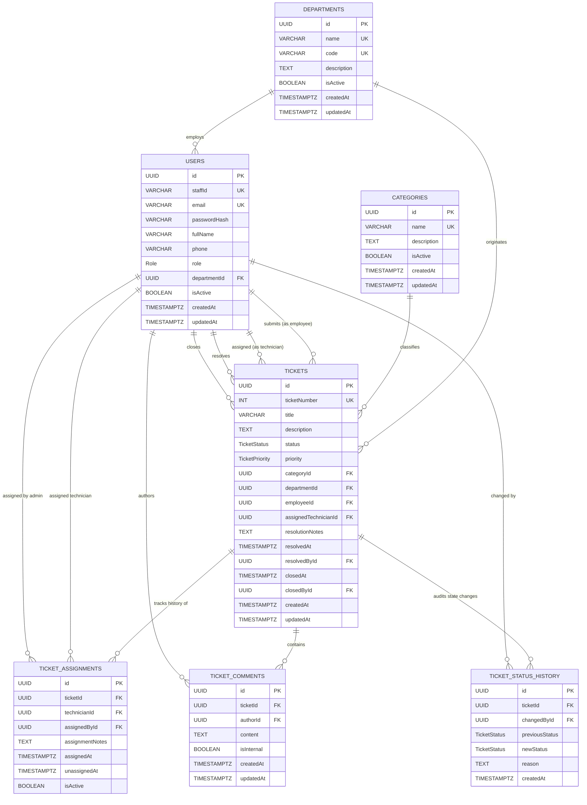

# Entity-Relationship (ER) Diagram: CBE IT Support Ticket Management System

> **Document Status:** Complete / Architectural Baseline (Phase 1)  
> **Target Schema:** Relational PostgreSQL Schema (3NF)  

---

## 1. Conceptual Entity-Relationship Diagram

---

## 2. Cardinality Analysis & Relational Rationale

### 2.1 Department to Users (`1 : N`)
* **Rationale:** A department houses many users. Each user belongs to exactly one primary organizational department.
* **Integrity:** `ON DELETE RESTRICT` ensures that deleting an organizational unit with active personnel is prevented.

### 2.2 Department to Tickets (`1 : N`)
* **Rationale:** Every ticket records the submitter's department at the time of creation. This facilitates department-level incident reporting and analytics even if a user later transfers departments.
* **Integrity:** `ON DELETE RESTRICT` guarantees historical departmental incident records remain immutable.

### 2.3 Category to Tickets (`1 : N`)
* **Rationale:** Each ticket belongs to exactly one category (e.g. HARDWARE, NETWORK). Categories can be created, updated, or disabled without affecting existing tickets.
* **Integrity:** `ON DELETE RESTRICT` blocks deletion of categories that have linked tickets.

### 2.4 User (Employee) to Tickets (`1 : N`)
* **Rationale:** An employee can submit many tickets over time. Every ticket has exactly one submitting employee.

### 2.5 User (Technician) to Tickets (`0..1 : N`)
* **Rationale:** A technician can be actively assigned to zero, one, or many tickets simultaneously. A newly created ticket in `OPEN` status has no technician (`assignedTechnicianId` is `NULL`).

### 2.6 Ticket to TicketAssignments (`1 : N`)
* **Rationale:** Over its lifecycle, a ticket may be assigned, escalated, or reassigned. Storing assignments in a dedicated entity preserves full historical accountability: who assigned whom, when, and why.
* **Integrity:** `ON DELETE CASCADE` cascades only if a ticket is physically removed from the system.

### 2.7 Ticket to TicketComments (`1 : N`)
* **Rationale:** Facilitates ongoing communication between the employee, technician, and administration, as well as private technical diagnostic notes (`isInternal = true`).

### 2.8 Ticket to TicketStatusHistory (`1 : N`)
* **Rationale:** An unalterable chronological audit log. For every state change from `OPEN` to `CLOSED` or `CANCELLED`, a history row is created capturing old state, new state, user ID, timestamp, and transition remarks.
