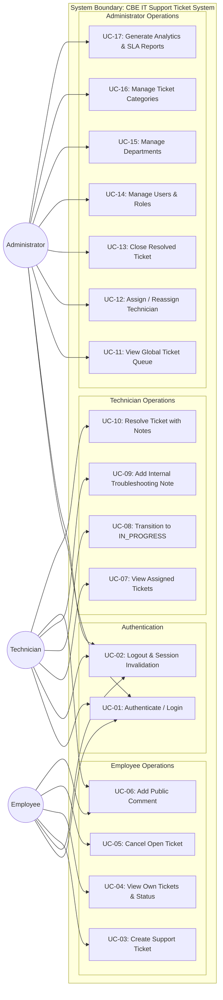

# Use Case Specification: CBE IT Support Ticket Management System

> **Document Status:** Complete / Architectural Baseline (Phase 1)  
> **Standard:** Unified Modeling Language (UML) / Use Case Narratives  

---

## 1. Conceptual Use Case Diagram

---

## 2. Detailed Use Case Narratives

### Use Case UC-03: Create Support Ticket
* **Primary Actor:** Employee
* **Preconditions:** Employee is authenticated with active account (`isActive == true`).
* **Main Success Scenario:**
  1. Employee navigates to the Ticket Submission portal.
  2. System loads available active Categories from `/api/categories`.
  3. Employee enters Title, Problem Description, Category, and perceived Priority.
  4. Employee clicks "Submit Ticket".
  5. System validates inputs against Zod schema rules.
  6. Backend automatically associates `employeeId` (from JWT session) and the employee's current `departmentId`.
  7. Backend sets `status = 'OPEN'`, creates the Ticket, and records the initial `TicketStatusHistory` entry in a database transaction.
  8. System redirects employee to the ticket detail page and displays confirmation.
* **Postconditions:** Ticket is stored in `OPEN` status and becomes visible in the Administrator unassigned dispatch queue.

---

### Use Case UC-12: Assign / Reassign Technician
* **Primary Actor:** Administrator
* **Preconditions:** Administrator is authenticated. Target ticket is in `OPEN`, `ASSIGNED`, or `IN_PROGRESS` status.
* **Main Success Scenario:**
  1. Administrator reviews the unassigned ticket queue.
  2. Administrator selects a ticket and clicks "Assign Technician".
  3. System presents a list of active technicians (`isActive == true`, `role == 'TECHNICIAN'`).
  4. Administrator selects a technician, optionally enters assignment notes, and submits.
  5. Backend verifies the target user is an active technician.
  6. In a single transaction:
     * Previous active assignment (if any) is updated with `unassignedAt = NOW()`, `isActive = false`.
     * New `TicketAssignment` is inserted with `isActive = true`.
     * Ticket record is updated with `assignedTechnicianId` and `status = 'ASSIGNED'`.
     * `TicketStatusHistory` record is appended (`previousStatus -> 'ASSIGNED'`).
  7. Administrator sees updated assignment confirmation.
* **Postconditions:** The ticket appears in the designated technician's active workspace queue.

---

### Use Case UC-10: Resolve Ticket with Notes
* **Primary Actor:** Technician
* **Preconditions:** Ticket is in `IN_PROGRESS` status and assigned to the authenticated technician.
* **Main Success Scenario:**
  1. Technician opens the assigned ticket workspace.
  2. Technician selects "Mark as Resolved".
  3. System prompts for mandatory Resolution Notes explaining root cause and resolution actions taken.
  4. Technician provides detailed resolution text (minimum 20 characters) and submits.
  5. Backend verifies that the caller is the assigned technician.
  6. In a single transaction:
     * Ticket status updated to `RESOLVED`.
     * `resolutionNotes`, `resolvedAt`, and `resolvedById` are updated.
     * `TicketStatusHistory` is appended (`IN_PROGRESS -> RESOLVED`).
  7. Technician workspace updates; notification/status update is visible to the submitting employee.
* **Postconditions:** Ticket status is `RESOLVED`, enabling the Administrator or Employee to conduct final verification.
